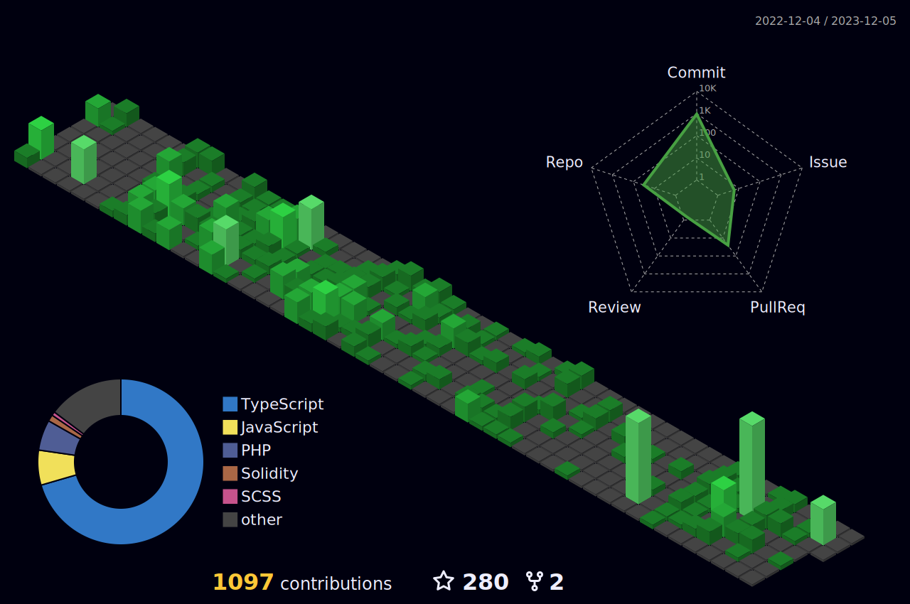

<h2>Hi There👋, I'm Prince RUKUNDO! </h2>

<!-- <p><em>Software Engineer at <a href="http://www.cleartax.in">ClearTax</a> 
</em></p> -->


###  A little more about me...  

```javascript
const prince = {
    pronouns: "He" | "Him",
    code: ["Javascript", "Typescript", "Python", "Java", "c/c++", "php"],
    askMeAbout: ["web dev", "tech", "mobile dev", "AI & ML", "blogging"],
    technologies: {
        mobileApp: ["firebase, react-native"],
        frontEnd: {
            js: ["Vue", "Nuxt", "react", "three js", "next js"],
            css: ["material ui", "bootstrap", "tailwind", "chakra ui", "daisy ui"]
        },
        backEnd: {
            js: ["node", "express", "typescript"],
            python: ["django", "fast-api"],
            java: ["springboot"]
        },
        databases: ["mongo", "MySql", "postgress"],
        misc: ["Firebase", "Socket.IO", "sanity", "open-cv", "php", "SuiteApp", "Appwrite"]
    },
    architecture: ["Serverless Architecture", "Progressive web applications", "Single page applications"],
    currentProject: "I am developing a social media app called snapgram, somehow like instagram",
    funFact: "There are two ways to write error-free programs; only the third one works"
};
```



 <em><b>I love connecting with different people</b> so if you want to say <b>hi, I'll be happy to meet you more!</b> 😊</em>

---
<!--START_SECTION:waka-->
**I'm a late 🐤** 

```text
🌞 Morning    95 commits     ███████░░░░░░░░░░░░░░░░░░   30.55% 
🌆 Daytime    78 commits     ██████░░░░░░░░░░░░░░░░░░░   25.08% 
🌃 Evening    112 commits    █████████░░░░░░░░░░░░░░░░   36.01% 
🌙 Night      26 commits     ██░░░░░░░░░░░░░░░░░░░░░░░   8.36%

```


📊 **This week I spent my time on** 

```text
⌚︎ Timezone: Egypt/Cairo

💬 Languages: 
JavaScript               6 hrs 40 mins  █████████░░░░░░░░░░░░░░░░   39.01% 
Python                   2 hrs 57 mins  ████░░░░░░░░░░░░░░░░░░░░░   17.28% 
PHP                      2 hrs 28 mins  ███░░░░░░░░░░░░░░░░░░░░░░   14.49% 
java                 2 hrs 1 min         ███░░░░░░░░░░░░░░░░░░░░░░   11.89% 
c++                     1 hr 10 mins    █░░░░░░░░░░░░░░░░░░░░░░░░   6.87%

🔥 Editors: 
vs code                 9 hrs 32 mins       ██████████████░░░░░░░░░░░   55.81% 
PyCharm                  5 hrs 4 mins       ███████░░░░░░░░░░░░░░░░░░   29.71% 
Intellij Idea                 2 hrs 28 mins       ███░░░░░░░░░░░░░░░░░░░░░░   14.49%
dev c++                2 hrs 28 mins   ██░░░░░░░░░░░░░░░░░░░░░░   9.7%

💻 Operating Systems: 
Windows                  17 hrs 5 mins       █████████████████████████   100.0%

```
<!--END_SECTION:waka-->

