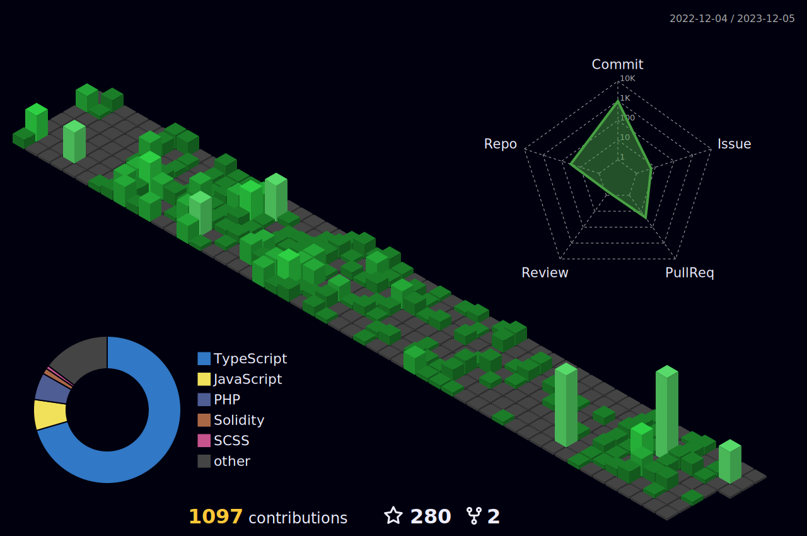

<h2>Hi There👋, I'm Prince RUKUNDO! </h2>

<p><em>Software Developer at <a href="https://nihemart.rw">Nihemart</a> 
</em></p>


###  A little more about me...  

```javascript
const prince = {
    pronouns: "He" | "Him",
    code: ["Javascript", "Typescript", "Python", "Java", "C/C++", "PHP", "C#", "Ruby"],
    askMeAbout: ["Web dev", "Tech", "Mobile dev", "Full stack", "AI & ML", "Devops", "AR & VR"],
    technologies: {
        mobileApp: ["React-native", "Swift", "Kotlin", "Flutter"],
        frontEnd: {
            js: ["Vue JS", "React JS", "Three JS", "Next JS"],
            css: ["MUI", "Bootstrap", "Tailwindcss", "Shadcn", "Chakra UI", "Daisy UI"],
            c#: ["Blazor"],
        },
        backEnd: {
            js: ["Node JS", "Express", "Nest JS"],
            python: ["Django", "Fast-API", "Streamlit", "Open-CV"],
            java: ["Springboot", "JSP", "Hibernate"],
            c#: [".net"],
        },
        databases: ["Mongo DB", "MySql", "PostgreSQL"],
        misc: ["Firebase", "Sanity", "SuiteApp", "Appwrite", "Sentry", "Clerk", "Upstash", "Arcjet"],
    },
    architecture: ["Serverless Architecture", "Progressive web applications", "Single page applications"],
    currentProject: "I am developing a platform for students to share and showcase their projects and promote collaboration
    funFact: "There are two ways to write error-free programs; only the third one works"
};
```



 <em><b>I love connecting with new people</b> so if you want to say <b>hi, I'll be happy to meet you!</b> 😊</em>

---
<!--START_SECTION:waka-->
**I'm a late 🐤** 

```text
🌞 Morning    97 commits     ███████░░░░░░░░░░░░░░░░░░   33.52% 
🌆 Daytime    89 commits     ██████░░░░░░░░░░░░░░░░░░░   26.34% 
🌃 Evening    129 commits    █████████░░░░░░░░░░░░░░░░   35.46%
🌙 Night      33 commits     ██░░░░░░░░░░░░░░░░░░░░░░░   9.15%

```


📊 **This week I spent my time on** 

```text
⌚︎ Timezone: Egypt/Cairo

💬 Languages: 
Typescript               7 hrs 32 mins  █████████░░░░░░░░░░░░░░░░   69.22% 
Python                   2 hrs 47 mins  ████░░░░░░░░░░░░░░░░░░░░░   18.29% 
Javascript                      2 hrs 32 mins  ███░░░░░░░░░░░░░░░░░░░░░░   6.25% 
java                 2 hrs 1 min         ███░░░░░░░░░░░░░░░░░░░░░░   5.29% 
c++                     1 hr 20 mins    █░░░░░░░░░░░░░░░░░░░░░░░░   3.38%

🔥 Editors: 
vs code                 9 hrs 32 mins       ██████████████░░░░░░░░░░░   54.82% 
PyCharm                  5 hrs 4 mins       ███████░░░░░░░░░░░░░░░░░░   26.71% 
Intellij Idea                 2 hrs 28 mins       ███░░░░░░░░░░░░░░░░░░░░░░   13.39%
dev c++                2 hrs 28 mins   ██░░░░░░░░░░░░░░░░░░░░░░   9.1%

💻 Operating Systems: 
Windows                  37 hrs 5 mins       █████████████████████████   100.0%

```
<!--END_SECTION:waka-->

